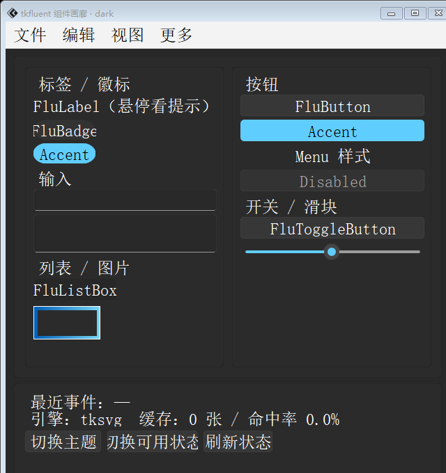
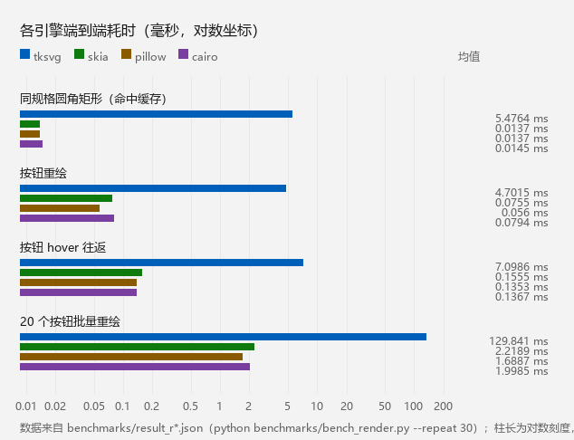

<div align="center">

# tkdeft

</div>

[](https://app.netlify.com/sites/tkdeft/deploys)

意为`灵巧`，灵活轻巧好用

一句话：**把矢量绘图变成 Tkinter 控件的底座。**

> 开发中

---

## 注意

> [!NOTE]
> 这里呢，已经成为[tkfluent](https://pypi.org/project/tkfluent)的基础库了，不含[tkfluent](https://pypi.org/project/tkfluent)的组件。
> 如果你想体验扩展界面库的效果，请去[tkfluent](https://pypi.org/project/tkfluent)查阅。

用这套零件搭出来的组件库长这样（[tkfluent](https://pypi.org/project/tkfluent)）：

| 浅色 | 深色 |
| --- | --- |
|  |  |

## 原理

一句话：**先用矢量绘图生成图片，再交给 `Canvas` / `Label` 显示出来。**

具体走哪条路是可切换的：

| 方式 | 过程 |
| --- | --- |
| SVG 引擎（默认 `tksvg`） | `svgwrite` 生成 SVG → 写临时文件 → `tksvg` 读回来栅格化 |
| 栅格引擎（`skia` / `pillow` / `cairo`） | 进程内直接画到位图，**完全不碰磁盘** |

> 这其中还是有些坑的（比如图片不显示——那其实是 `PhotoImage` 被垃圾回收导致的），
> 完整清单见文档站的[常见问题与排查](docs/docs/usage/faq.md)。

## 快速上手

```bash
pip install -U tkdeft
```

```python
import tkinter

from tkdeft.windows.canvas import DCanvas

root = tkinter.Tk()
canvas = DCanvas(root, width=240, height=120, background="#f3f3f3")
canvas.pack()

# 一行画图元：栅格引擎走进程内快速路径，否则自动回退 SVG
canvas.draw_roundrect(20, 20, 200, 76, 8,
                      fill="#ffffff", outline="#000000", outline_opacity=0.25)

root.mainloop()
```

完整文档（安装 / 快速上手 / 概念与架构 / 指南 / API）：
<https://tkdeft.netlify.app>

## 绘制引擎

`tkdeft` 把"**画什么**"和"**用什么画**"分开了。组件只需要描述一个
`RoundRectSpec`（尺寸、圆角、填充、描边……），具体由哪个引擎栅格化是可切换的。

同一份规格交给 5 个引擎：


```python
from tkdeft.engines import set_engine, list_engines, describe_engines, cache_stats

print(list_engines())      # {'tksvg': True, 'wand': True, 'skia': True, ...}
set_engine("skia")         # 或 set_engine(2)
print(cache_stats())       # 缓存命中率，便于诊断
```

| 编号 | 引擎 | 类型 | 说明 | 额外依赖 |
| --- | --- | --- | --- | --- |
| 0 | `tksvg` | SVG | 默认，保持既有行为 | 无 |
| 1 | `wand` | SVG | 经 Wand(ImageMagick) 转 PNG | `Wand` |
| 2 | `skia` | 栅格 | skia-python，进程内出图，画质与速度最好 | `pip install tkdeft[skia]` |
| 3 | `pillow` | 栅格 | Pillow 超采样，**永远可用** | 无（Pillow 是硬依赖） |
| 4 | `cairo` | 栅格 | pycairo | `pip install tkdeft[cairo]` |

栅格引擎不写临时文件、不解析 SVG、不碰磁盘；渲染结果按规格缓存，
**同尺寸同配色的一组控件共用同一张图片**。

### 实测（120×32 圆角矩形，本机）



| 场景 | 优化前 | 仅修基础设施 | + skia 引擎 |
| --- | --- | --- | --- |
| 圆角矩形（尺寸各异） | 13.81 ms | 4.94 ms | **1.26 ms** |
| 圆角矩形（参数相同） | 10.80 ms | 4.33 ms | **0.02 ms** |
| 按钮重绘 | 5.95 ms | 2.86 ms | **0.15 ms** |
| 按钮 hover 往返 | 13.65 ms | 6.08 ms | **0.26 ms** |
| 20 个按钮批量重绘 | 139.9 ms | 110.4 ms | **2.93 ms** |

复现：`python benchmarks/run_all.py`（9 项回归 + 性能基准，详见
[回归与性能](docs/docs/usage/benchmarks.md)）

## 已修复的缺陷

这一轮审查中定位并修掉的真实问题（都不是"风格问题"）：

| 问题 | 影响 |
| --- | --- |
| `DSvgDraw.temppath()` 每次调用都 `mkstemp()` 且**从不关闭返回的 fd** | 每绘制一帧泄漏一个句柄，并在临时目录留下一个残留文件 |
| `DDrawWidget.__init__` 一次性 `mkstemp()` 四个临时文件 | 每个控件创建即泄漏 4 个句柄（20 个按钮 = 80 个） |
| `DCanvas.create_round_rectangle` 只把图片存进 `self._img` / `self._tkimg` | 同一画布上多张图片时，除最后一张外都会被 GC，**画布 item 变空白** |
| `RenderManager._render_all` 调用 `widget.winfo_zorder()` | `tkinter` **没有**这个方法，只要有脏控件就抛 `AttributeError` |
| `RenderManager._schedule_render` 里 `tk._default_root or list(...)[0]` | 两者都不可用时 `IndexError` |
| `_draw` 结尾又 `mark_dirty(self)` | 集中式调度下同一控件被重绘两遍 |
| svgwrite 生成的矩形用 `translate(0.5,0.5)` + 整宽整高 | 描边中心线压在画布边界上，**外侧半个线宽被裁掉** |
| `create_svg_image` 对 `way` 未做兜底 | 回退路径遇到非 0/1 的渲染器编号会直接失败 |
| `tkdeft.svg` 把 `None` / `"transparent"` 直接交给 svgwrite | 栅格引擎认这两者，svgwrite 只认 `"none"` → 同一份规格换了引擎就 `TypeError` |

## 计划

未来我打算先制作出`SunValley`设计的库然后就去做别的项目，[tkfluent](https://pypi.org/project/tkfluent)

至于完整文档，我后面会加紧制作的。

设计来源： https://pixso.cn/community/file/ItC5JH1TOwj15EeOPcY7LQ?from_share

### 为什么不像tkadw一样做跟易用的主题？

因为`svg`能实现很多漂亮的组件，而我套的模板可能不对其它设计起太大的作用

所以我将这个设计库放在这里当做模板，供其它设计者参考使用。

## 更新日志

版本变更统一记录在文档站的[更新日志](https://tkdeft.netlify.app/blog/)里
（源文件在 `docs/docs/blog/posts/`），按时间倒序排列：

| 版本 | 一句话 | 发布说明 |
| --- | --- | --- |
| `0.3.0` | 把对外接口补齐：统一绘制入口、引擎查询、`DObject` 补全 | [2026-09-13](docs/docs/blog/posts/2026-09-13.md) |
| `0.2.0` | 可插拔绘制引擎层 + 进程内栅格引擎 + 规格缓存 | [2026-09-12](docs/docs/blog/posts/2026-09-12.md) |
| `0.1.0` | 完善功能 | [2025-06-26](docs/docs/blog/posts/2025-06-26.md) |
| 更早 | `0.0.1` – `0.0.9` 的起步阶段 | [回顾](docs/docs/blog/posts/2024-01-26.md) |