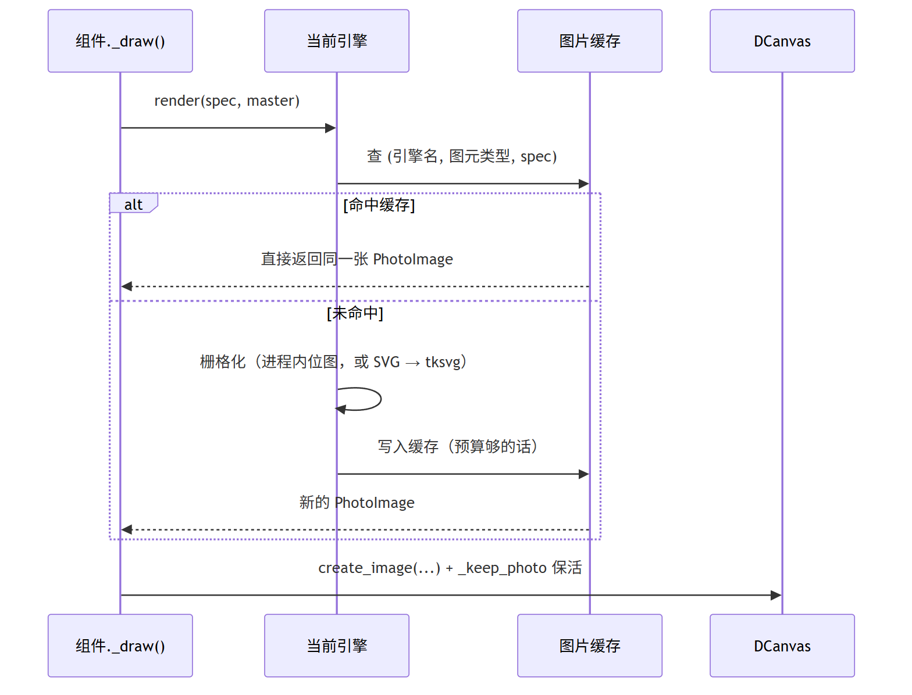

# 概念与架构

`tkdeft` 只做一件事：**把矢量绘图变成 Tkinter 控件**。为了做到这一点，它把过程拆成了
三段，每段都可以单独替换。

<figure markdown>
  
  <figcaption>规格 → 引擎 → 画布。虚线是规格缓存：命中时中间的栅格化整段被跳过</figcaption>
</figure>

## 三个概念

### 绘制规格（spec）：只描述"画什么"

规格是**不可变的 dataclass**，只有尺寸、圆角、颜色、透明度这些"内容"，
不含任何"怎么画"的信息：

```python
from tkdeft.engines import RoundRectSpec

spec = RoundRectSpec(
    width=120, height=32, rx=6,          # 尺寸与圆角
    fill="#ffffff",                       # 填充
    outline="#000000", outline_opacity=0.25, outline_width=1,
)

spec.kind        # 'roundrect' —— 与引擎上的 render_roundrect() 对应
spec.pixels      # 3840 —— 缓存预算按它核算
spec.to_dict()   # 转成普通字典，便于打日志
```

坐标一律以**自身左上角为 `(0, 0)`**；规格描述的是"一张位图长什么样"，
不是"摆在窗口的哪里"。要按画布坐标构造，用 `RoundRectSpec.from_box(x1, y1, x2, y2, radius)`。

| 规格 | `kind` | 用途 |
| --- | --- | --- |
| `RoundRectSpec` | `roundrect` | 按钮、面板、输入框背景 |
| `TrackSpec` | `track` | 滑块、滚动条的轨道（选中段 + 底轨） |
| `ThumbSpec` | `thumb` | 滑块的圆把手（渐变伪阴影 + 两层填充） |

<figure markdown>
  
  <figcaption>三种规格对应的图元；渲染来自真实引擎，放大 3 倍</figcaption>
</figure>

### 绘制引擎（engine）：只负责"用什么画"

引擎实现 `render_roundrect(spec)` 之类的接口，**返回一张 `PIL.Image`**。
`tkdeft` 内置 5 个，随时可切，也可以自己注册：

```python
from tkdeft.engines import describe_engines, set_engine

set_engine("skia")
describe_engines()[2]
# {'name': 'skia', 'index': 2, 'kind': 'raster', 'available': True,
#  'requires': ('skia', 'numpy', 'PIL'), 'aliases': ('2',), 'current': False, ...}
```

**只有 `kind == "raster"` 的引擎会走快速路径**；`tksvg` / `wand` 是 SVG 系，
它们不参与栅格化，画布遇到它们会自动回退到 SVG 实现。

### 画布与控件：负责"摆在哪、什么时候重绘"

[`DCanvas`](../api/tkdeft.windows.canvas.md) 是带绘制能力的画布；

* 它的 `draw_roundrect` / `draw_track` / `draw_thumb` 会**先问引擎**，
  引擎不参与就自动回退 SVG，所以调用方只需要写一行；
* 它替你**保活 `PhotoImage`**（否则图片会被 GC，画布变空白）；
* 它按 item id 记录引用，并在控件销毁时回收临时文件。

[`DDrawWidget`](../api/tkdeft.windows.drawwidget.md) 再往上加一层交互骨架：
把鼠标与焦点事件翻译成 `enter` / `button1` / `isfocus` 三个状态位，
然后调你的 `_draw()`。控件状态与取值见 [自定义组件](../usage/custom-widget.md)。

控件长什么样，完全由"配置字典 + `_draw()`"决定，所以换主题就是换一份字典再重绘一次：

<figure markdown>
  
  <figcaption>同一套组件（tkfluent）切到深色主题：绘制层一行没改，只是配色字典变了</figcaption>
</figure>

## 一次重绘发生了什么

<figure markdown>
  
  <figcaption>一次重绘：先查缓存，命中就直接复用同一张 <code>PhotoImage</code></figcaption>
</figure>

两个关键点：

1. **同尺寸同配色的一组控件共用同一张图片**——这就是"缓存命中"能快几百倍的原因；
2. 缓存**不做 LRU 淘汰**，而是按像素预算（默认 8M 像素）"满了就不再写入"。
   因为 `PhotoImage` 一旦被回收，引用它的画布 item 会变成空白——**淘汰等于损坏画面**。
   详见 [绘制引擎](../usage/custom-drawing.md#cache)。

## 描边为什么必须内缩 { #stroke-inset }

SVG 的描边是**以路径为中心线**向两侧各画半个线宽。如果矩形几何铺满 `0..w / 0..h`，
描边中心线就正好压在画布边界上，**外侧那半个线宽落到画布之外**：

<figure markdown>
  
  <figcaption>左侧是"几何不内缩"：外侧半个线宽被裁掉；右侧是正确做法：几何内缩半个线宽（示意图，线宽已放大到 16px）</figcaption>
</figure>

`tkdeft.svg.roundrect_geometry()` 是**唯一的几何实现**，SVG 引擎与栅格引擎共用它，
所以两条路径画出来的东西是一致的。自己拼 SVG 时请直接用
[`tkdeft.svg.add_roundrect()`](../api/tkdeft.svg.md)，不要手写 `translate(0.5, 0.5)`。

## 图片保活：Tkinter 的经典陷阱

Tkinter 的画布元素**不会**替 Python 侧持有 `PhotoImage` 引用。图片对象一旦被 GC，
对应的 canvas item 就变成**空白**：

```python
# ✗ 只存"最后一张"：画第二张时第一张就失去引用
self._tkimg = canvas.svgdraw.create_svg_image(path)
canvas.create_image(0, 0, anchor="nw", image=self._tkimg)

# ✓ 让画布按 item id 保管
photo = canvas.svgdraw.create_svg_image(path)
item = canvas.create_image(0, 0, anchor="nw", image=photo)
canvas._keep_photo(item, photo)
```

用 `draw_roundrect` 这类统一入口时，保活是自动的。更多症状与排查见
[常见问题与排查](../usage/faq.md)。

## 引擎能力对照

| | `tksvg`（默认） | `wand` | `skia` | `pillow` | `cairo` |
| --- | --- | --- | --- | --- | --- |
| 类型 | SVG | SVG | 栅格 | 栅格 | 栅格 |
| 额外依赖 | 无 | `Wand` | `skia-python` | 无 | `pycairo` |
| 走画布快速路径 | ✗ | ✗ | ✓ | ✓ | ✓ |
| 椭圆圆角（`rx != ry`） | ✓ | ✓ | ✓ | ✗ 只支持单一半径 | ✓ |
| 抗锯齿 | tksvg 自带 | ImageMagick | 最好 | 超采样 | 原生 |

默认仍是 `tksvg`：栅格引擎与它有亚像素差异，为了让老项目升级后**一个像素都不变**。

## 目录导览

| 你在想什么 | 去读 |
| --- | --- |
| "先让我跑起来" | [快速上手](quickstart.md) |
| "引擎怎么选、缓存怎么配" | [绘制引擎](../usage/custom-drawing.md) |
| "我要写自己的组件" | [自定义组件](../usage/custom-widget.md) |
| "它到底快多少、怎么验" | [回归与性能](../usage/benchmarks.md) |
| "报错了" | [常见问题与排查](../usage/faq.md) |
| "从 0.2 升上来要注意什么" | [从 0.2 升级到 0.3](../usage/upgrade-0.3.md) |
| "某个函数签名是什么" | [API 文档](../api/index.md) |
