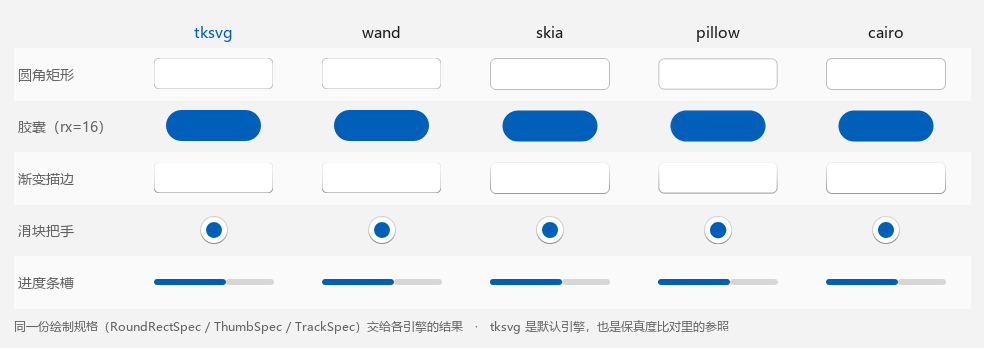
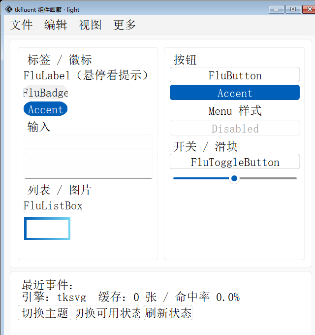

# 快速上手

这一页只做一件事：让你在五分钟内看到东西。

## 1. 第一个圆角矩形

`tkdeft` 里"画一个图元"= **描述一份规格 + 交给画布**：

```python
import tkinter

from tkdeft.windows.canvas import DCanvas

root = tkinter.Tk()
root.geometry("240x120")
root.title("tkdeft 快速上手")

canvas = DCanvas(root, width=240, height=120, background="#f3f3f3")
canvas.pack()

canvas.draw_roundrect(
    20, 20, 200, 76, 8,
    fill="#ffffff", outline="#000000", outline_opacity=0.25, width=1,
)

root.mainloop()
```

`draw_roundrect` 返回画布 item id（一定能拿到，不用判空）：当前引擎是栅格引擎时
它走**进程内位图快速路径**，否则自动回退到 SVG。你不需要为两条路径写两份代码。

!!! tip "为什么不是 `create_image` + 手拼 SVG？"
    那也可以，但你得自己处理"描边居中导致边框被裁"和"`PhotoImage` 被 GC 导致画面变空白"
    这两个经典陷阱。统一入口把它们都包了，见 [概念与架构](concepts.md#stroke-inset)。

## 2. 三种图元，一份 API

| 方法 | 图元 | 典型用途 |
| --- | --- | --- |
| `draw_roundrect(...)` | 圆角矩形 | 按钮、面板、输入框背景 |
| `draw_track(...)` | 进度条槽 | 滑块、滚动条的轨道 |
| `draw_thumb(...)` | 圆形把手 | 滑块的旋钮 |

<figure markdown>
  
  <figcaption>三种绘制规格：<code>RoundRectSpec</code> / <code>TrackSpec</code> / <code>ThumbSpec</code>（图里的渲染来自真实引擎，放大 3 倍）</figcaption>
</figure>

## 3. 换引擎：一行的事

```python
from tkdeft.engines import list_engines, set_engine

print(list_engines())
# {'tksvg': True, 'wand': True, 'skia': True, 'pillow': True, 'cairo': True}

set_engine("skia")        # 或 set_engine(2)
```

同一份规格在不同引擎下的结果：

<figure markdown>
  
  <figcaption>同一份绘制规格交给 5 个引擎的结果。默认引擎 <code>tksvg</code> 也是保真度比对里的参照</figcaption>
</figure>

换引擎不改一行业务代码；实测差距见 [回归与性能](../usage/benchmarks.md)。

## 4. 不起窗口，直接要一张图

需要图标、缩略图或做离线渲染时，可以直接拿 `PhotoImage`：

```python
import tkinter

from tkdeft.engines import RoundRectSpec, render_roundrect

root = tkinter.Tk()
root.withdraw()                       # 不显示窗口，但仍需要一个 Tk 解释器

spec = RoundRectSpec(
    width=120, height=32, rx=6,
    fill="#ffffff", outline="#000000",
    outline_opacity=0.25, outline_width=1,
)
photo = render_roundrect(spec, master=root)

print(photo.width(), photo.height())  # 120 32
```

`master=` 必须传：`PhotoImage` 绑定在具体的 Tk 解释器上，漏传会让图片挂到默认根窗口，
多解释器场景下会报 `image "pyimage1" doesn't exist`。

当前引擎是 SVG 系时 `render_*` 返回 `None`，表示"这条路径我不参与"。
想要"不管什么引擎都拿到图"，用画布上的 `draw_roundrect`。

## 5. 一个能点的小控件

`DDrawWidget` 把「事件 → 状态 → 重绘」这条链路铺好了，你只要写 `_draw`：

```python
import tkinter

from tkdeft.windows.canvas import DCanvas
from tkdeft.windows.drawwidget import DDrawWidget

COLORS = {"rest": "#f3f3f3", "hover": "#ffffff", "pressed": "#e0e0e0"}


class MyWidget(DCanvas, DDrawWidget):
    def _draw(self, event=None):
        super()._draw(event)
        if not self.winfo_ismapped():
            return
        self.delete("all")                      # 整幅重绘
        self.draw_roundrect(
            0, 0, self.winfo_width(), self.winfo_height(), 6,
            fill=COLORS[self.interaction_state()],
            outline="#000000", outline_opacity=0.25,
        )


root = tkinter.Tk()
widget = MyWidget(root, width=160, height=44, background="#f3f3f3")
widget.pack(padx=20, pady=20)
widget.bind("<<Clicked>>", lambda event: print("clicked"))
root.mainloop()
```

`interaction_state()` 会把 `enter` / `button1` 两个状态位归并成
`rest` / `hover` / `pressed`（不可用时是 `disabled`）。

用 tkdeft 搭出来的完整组件库长这样（那就是 [tkfluent](https://pypi.org/project/tkfluent)）：

<figure markdown>
  
  <figcaption>tkfluent 的组件画廊——全部由 tkdeft 的这些零件搭成（浅色主题）</figcaption>
</figure>

## 下一步

| 想做的事 | 看这里 |
| --- | --- |
| 搞清楚规格 / 引擎 / 画布的关系 | [概念与架构](concepts.md) |
| 引擎怎么选、缓存怎么回事、自己写引擎 | [绘制引擎](../usage/custom-drawing.md) |
| 从零搭一个自己的组件 | [自定义组件](../usage/custom-widget.md) |
| 出问题了 | [常见问题与排查](../usage/faq.md) |
