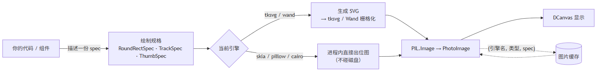

# tkdeft

[](https://app.netlify.com/sites/tkdeft/deploys)

意为 `灵巧`，灵活轻巧好用。

一句话：**把矢量绘图变成 Tkinter 控件的底座。**

它本身**不含**任何具体组件（按钮、输入框都没有），只提供零件——
[tkfluent](https://pypi.org/project/tkfluent) 就是用这些零件搭出来的组件库：

<figure markdown>
  
  <figcaption>用 tkdeft 搭出来的组件库（tkfluent）——按钮、徽标、输入框、滑块、面板全部由这里的图元拼成</figcaption>
</figure>

## 它解决什么问题

Tkinter 想做出现代界面，通常得"先用矢量绘图生成图片，再交给 `Canvas` 显示"。
这段路有三个反复踩的坑：

| 坑 | tkdeft 的做法 |
| --- | --- |
| 每帧都要写 SVG 文件再读回来，慢 | 可插拔引擎：`skia` / `pillow` / `cairo` **进程内出图，完全不落盘**；配合规格缓存后按钮重绘快 **几十倍** |
| 图片被 GC 后画布元素变空白 | 画布按 item id 保管 `PhotoImage` 引用，统一入口内部自动保活 |
| 描边居中导致下/右边框被裁 | `tkdeft.svg` 统一几何：**内缩半个线宽**，SVG 与栅格引擎共用同一套规则 |

细节见 [概念与架构](getstarted/concepts.md)。

## 快速上手

```bash
pip install -U tkdeft
```

```python
import tkinter

from tkdeft.windows.canvas import DCanvas

root = tkinter.Tk()
canvas = DCanvas(root, width=240, height=120, background="#f3f3f3")
canvas.pack()

# 一行画图元：栅格引擎走进程内快速路径，否则自动回退 SVG
canvas.draw_roundrect(20, 20, 200, 76, 8,
                      fill="#ffffff", outline="#000000", outline_opacity=0.25)

root.mainloop()
```

想换引擎、拿单张图片、写自己的控件：[快速上手](getstarted/quickstart.md)。

## 绘制引擎

同一份**绘制规格**（`RoundRectSpec` / `TrackSpec` / `ThumbSpec`）交给不同引擎：

<figure markdown>
  
  <figcaption>5 个内置引擎渲染同一组规格的结果。<code>tksvg</code> 是默认引擎，也是保真度比对里的参照</figcaption>
</figure>

| 编号 | 引擎 | 类型 | 说明 | 额外依赖 |
| --- | --- | --- | --- | --- |
| 0 | `tksvg` | SVG | 默认，保持既有行为 | 无 |
| 1 | `wand` | SVG | 经 Wand(ImageMagick) 转 PNG | `Wand` |
| 2 | `skia` | 栅格 | skia-python，进程内出图，画质与速度最好 | `pip install tkdeft[skia]` |
| 3 | `pillow` | 栅格 | Pillow 超采样，**永远可用** | 无（Pillow 是硬依赖） |
| 4 | `cairo` | 栅格 | pycairo | `pip install tkdeft[cairo]` |

```python
from tkdeft.engines import set_engine, list_engines, describe_engines, cache_stats

print(list_engines())      # {'tksvg': True, 'wand': True, 'skia': True, ...}
set_engine("skia")         # 或 set_engine(2)
print(cache_stats())       # 命中率，便于诊断
```

<figure markdown>
  
  <figcaption>规格 → 引擎 → 画布。中间那条虚线是规格缓存：命中时中间的栅格化整段被跳过</figcaption>
</figure>

## 文档导航

| 从零开始 | |
| --- | --- |
| [安装](getstarted/install.md) | 环境要求、可选引擎、验证安装 |
| [快速上手](getstarted/quickstart.md) | 五分钟跑通第一个图元与控件 |
| [概念与架构](getstarted/concepts.md) | 规格 / 引擎 / 画布，一次重绘发生了什么 |

| 深入使用 | |
| --- | --- |
| [绘制引擎](usage/custom-drawing.md) | 切换、查询、缓存、颜色、自己写引擎 |
| [自定义组件](usage/custom-widget.md) | 用这些零件搭一个自己的控件 |
| [回归与性能](usage/benchmarks.md) | 9 项回归与性能基准怎么跑 |
| [常见问题与排查](usage/faq.md) | 13 条真实踩过的坑 |
| [从 0.2 升级到 0.3](usage/upgrade-0.3.md) | 纯加法升级，值得顺手改的四处 |

| 参考 | |
| --- | --- |
| [API 文档](api/index.md) | 由源码文档字符串自动生成 |
| [什么是模板](template/index.md) | 为什么这个库不直接做成主题库 |

## 项目状态

| | |
| --- | --- |
| 版本 | `0.3.0`（tkdeft 与 tkfluent 同步发版） |
| 回归 | `python benchmarks/run_all.py` **9 项**全绿（引擎自检 / 保真度 / 画廊 / 冒烟 / 保活 / 布局 / 命令行 / 文档站 / 性能） |
| 文档站 | `mkdocs build --strict` 零警告 |
| 静态检查 | `ruff check tkdeft` 零告警 |

```bash
# 一条命令验证一切（9 项）
python benchmarks/run_all.py --quick      # 8 项，跳过性能基准
python benchmarks/run_all.py              # 9 项
```

## 计划

未来我打算先制作出 `SunValley` 设计的库然后就去做别的项目，
[tkfluent](https://pypi.org/project/tkfluent)。

至于完整文档，我后面会加紧制作的。

## 设计来源

<https://pixso.cn/community/file/ItC5JH1TOwj15EeOPcY7LQ?from_share>

### 为什么不像 tkadw 一样做更易用的主题？

因为 `svg` 能实现很多漂亮的组件，而我套的模板可能不对其它设计起太大的作用。

所以我将这个设计库放在这里当做模板，供其它设计者参考使用。

## 更新日志

### 2026-09-13
发布`0.3.0`版本，主要工作是**把接口补齐、讲清楚**：

* **绘制引擎层**
    * 引擎注册表补充 `available_engines()` / `engine_names()` / `engine_index()` /
      `engine_from_index()` / `describe_engines()` / `reset_engine()` / `unregister_engine()`
    * 引擎基类新增 `render(spec)`（按规格类型分发）、`supports(kind)`、`info()`、`index`
    * 拼错引擎名现在抛 `UnknownEngineError`，并给出"你是不是想用 …"的提示
    * 渲染入口新增 `render(spec)` 与 `RENDERERS`；渲染失败可用
      `last_engine_error()` / `clear_engine_error()` 查询
    * 三种规格补齐 `from_box()`（按坐标对构造）、`pixels`、`to_dict()`、`describe()`、`kind`
* **画布层**
    * `DCanvas` 新增统一绘制入口 `draw_roundrect()` / `draw_track()` / `draw_thumb()`：
      有栅格引擎就走位图快速路径，否则自动回退 SVG，返回值一定是 item id
    * 新增可覆盖的 SVG 钩子 `draw_roundrect_svg()` / `draw_track_svg()` /
      `draw_thumb_svg()` 与 `draw_svg_item()`，组件不必再抄一遍回退逻辑
    * `raster_enabled` / `raster=False` 可以强制走 SVG（做引擎对照时很方便）
* **绘制后端**
    * `DSvgDraw` 补齐通用图元 `create_roundrect()` / `create_track()` / `create_thumb()`
    * `create_svg_image(..., way=None)` 默认按当前引擎自动挑 tksvg / Wand
    * `tkdeft.svg` 新增 `svg_paint()` / `gradient_stop()`：`None` 与 `"transparent"`
      不再让 svgwrite 抛 `TypeError`，两条路径对"没有颜色"的处理终于一致
* **基础件**
    * `DObject` 补全 `dget` / `dhas` / `dkeys` / `dcopy` / `dreset` 等接口，
      实例现在拥有自己的属性字典（不再共享类级默认值）
    * 顶层 `tkdeft` 再导出常用名字；新增 `__version_info__`
* **文档**
    * 新增[安装](getstarted/install.md)/[快速上手](getstarted/quickstart.md)/
      [概念与架构](getstarted/concepts.md)三页，补上[回归与性能](usage/benchmarks.md)、
      [常见问题与排查](usage/faq.md)、[从 0.2 升级到 0.3](usage/upgrade-0.3.md)
    * 插图由 `docs/gen_figures.py` 用**真实引擎**生成，可重新跑
    * `tkfluent` 同步跟进：组件里的回退样板收敛到 tkdeft（9 个模块约 -400 行）

### 2026-09-12
发布`0.2.0`版本：

* 新增 `tkdeft.engines` 绘制引擎层，可插拔切换 `tksvg` / `wand` / `skia` / `pillow` / `cairo`
* 新增进程内栅格引擎（skia-python / Pillow / pycairo），完全不落盘
* 新增按规格缓存的图片缓存，参数相同的绘制结果直接复用
* 新增 SVG 形状助手 `tkdeft.svg`，统一并修正圆角矩形几何
* 修复临时文件 / fd 泄漏、`PhotoImage` 被 GC 导致画面空白、
  `RenderManager` 的 `winfo_zorder` 崩溃等问题
* 文档补齐：[绘制引擎](usage/custom-drawing.md)、[自定义组件](usage/custom-widget.md)、
  [API 文档](api/index.md)

### 2025-06-26
发布`0.1.0`版本，完善功能

### 2024-09-16
发布`0.0.9`版本，一些小修改

### 2023-01-26
发布`0.0.7`版本，模板库`Fluent`已移至`tkfluent`库

### 2023-01-25
发布`0.0.3` `0.0.4`版本，粗心了，两次补充依赖

发布`0.0.5`版本，模板组件主题由`theme(mode=..., style=...)`设置，不再使用如`DDarkButton`这样的，添加`DWindow.wincustom`自定义窗口（仅限Windows）

发布`0.0.6`版本，模板组件`DBadge`补充样式`style=accent`，并对自定义窗口进行稍微调整

### 2023-01-23
发布`0.0.2`版本，补充模板组件`DEntry`、`DFrame`、`DText`, `DBadge`

### 2024-01-22
发布`0.0.1`版本，模板组件包括`DButton`
