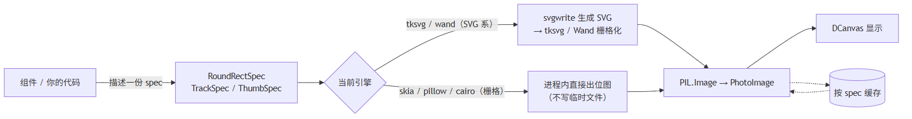
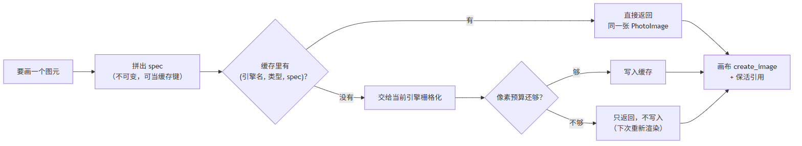
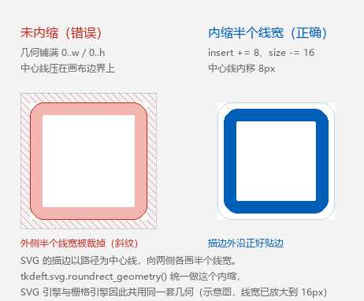

# 绘制引擎

`tkdeft` 把"**画什么**"和"**用什么画**"分开了。

组件不再直接拼 SVG，而是描述一个 **绘制规格（spec）**——尺寸、圆角、填充色、
描边色与透明度……然后把它交给**当前引擎**去栅格化。换引擎不需要改一行业务代码。

<figure markdown>
  
  <figcaption>同一份规格的两条路：SVG 系落文件，栅格系进程内出图；结果都按规格缓存</figcaption>
</figure>

同一份规格在各引擎下的实际结果：

<figure markdown>
  
  <figcaption>5 个内置引擎渲染同一组规格（圆角矩形 / 胶囊 / 渐变描边 / 滑块把手 / 进度条槽）。<code>tksvg</code> 是默认引擎，也是保真度比对里的参照</figcaption>
</figure>

## 内置引擎

| 编号 | 引擎 | 类型 | 说明 | 额外依赖 |
| --- | --- | --- | --- | --- |
| 0 | `tksvg` | SVG | 默认。`svgwrite` 生成 SVG → `tksvg` 栅格化，保持历史行为 | 无 |
| 1 | `wand` | SVG | 经 Wand(ImageMagick) 转 PNG | `Wand` |
| 2 | `skia` | 栅格 | `skia-python`，进程内直接出位图，速度与画质最好 | `pip install tkdeft[skia]` |
| 3 | `pillow` | 栅格 | Pillow 超采样抗锯齿，**永远可用** | 无（Pillow 是硬依赖） |
| 4 | `cairo` | 栅格 | `pycairo` | `pip install tkdeft[cairo]` |

编号是为了兼容历史的 `set_renderer(0..4)`；新代码推荐直接用引擎名。

## 切换引擎

```python
from tkdeft.engines import (
    set_engine, get_engine, get_engine_name, reset_engine,
    list_engines, available_engines, describe_engines,
)

list_engines()
# {'tksvg': True, 'wand': True, 'skia': True, 'pillow': True, 'cairo': True}
available_engines()
# ['tksvg', 'wand', 'skia', 'pillow', 'cairo']

set_engine("skia")     # 按名字
set_engine(2)          # 或按编号（两种写法等价）

get_engine_name()      # -> "skia"
get_engine().kind      # -> "raster"
reset_engine()         # 恢复默认引擎（tksvg）
```

`describe_engines()` 会返回一份**结构化**的引擎清单，适合直接打印或喂给命令行：

```python
for row in describe_engines():
    print(row["index"], row["name"], row["kind"], row["available"],
          row["requires"], row["description"], row["aliases"], row["current"])
```

引擎不可用时 `set_engine` 会抛 `ValueError`（而不是静默退回慢路径），
免得你以为开了 `skia`、其实还在走磁盘；名字拼错则抛
`UnknownEngineError`（`ValueError` 的子类），错误信息里会附上"你是不是想用 …"。

`get_engine(name, strict=False)` 可以退回"名字未知就用当前引擎"的历史行为。

## 直接渲染一张图

```python
from tkdeft.engines import RoundRectSpec, render, render_roundrect

spec = RoundRectSpec(
    width=120, height=32, rx=6,
    fill="#ffffff", fill_opacity=1,
    outline="#000000", outline_opacity=0.2,
    outline_width=1,
)

photo = render_roundrect(spec, master=widget)   # -> tkinter.PhotoImage
photo = render(spec, master=widget)             # 同一件事：按 spec 类型自动分发
```

可用的规格有三类，`spec.kind` 就是它们的类型名：

| 规格 | `kind` | 用途 |
| --- | --- | --- |
| `RoundRectSpec` | `"roundrect"` | 圆角矩形（按钮、面板、输入框背景） |
| `TrackSpec` | `"track"` | 滑块/滚动条的进度条槽 |
| `ThumbSpec` | `"thumb"` | 滑块/滚动条的圆形把手 |

规格是**不可变**的（`frozen dataclass`），因此可以当缓存键，也方便比较和调试：

```python
spec.pixels          # 位图像素数（缓存预算按它核算）
spec.to_dict()       # 转成普通 dict
spec.describe()      # 一行摘要

# 画布 API 习惯用"两个角"描述矩形，可以直接换算
RoundRectSpec.from_box(0, 0, 120, 32, radius=6, fill="#ffffff")
```

当前引擎是 SVG 系时 `render_*` 返回 `None`，表示"这条路径我不参与"，
调用方应当回退到既有的 `svgwrite` + `tksvg` 流程。

## 缓存 { #cache }

渲染结果按 `(引擎名, 图元类型, spec)` 缓存。因为 spec 是不可变的，
**同尺寸同配色的一组控件会共用同一张 `PhotoImage`**。

```python
from tkdeft.engines import (
    cache_stats, set_cache_budget, clear_cache, get_cache, DEFAULT_PIXEL_BUDGET,
)

print(cache_stats())
# {'interpreters': 1, 'entries': 62, 'pixels': 169244, 'budget': 8000000,
#  'hits': 178, 'misses': 99, 'hit_rate': 0.642, 'overflow': 0}

set_cache_budget(16_000_000)   # 调大像素预算（默认 8_000_000 像素）
clear_cache()                  # 清空（注意：会清掉已发出的图片引用）

cache = get_cache(widget)      # 也可以直接拿某个 Tk 解释器的缓存对象
cache.stats()                  # 命中率、条目数、溢出次数
```

缓存**不做 LRU 淘汰**。原因是 `PhotoImage` 一旦被回收，
引用它的 canvas item 会变成**空白**——这是 Tkinter 的经典陷阱。
所以这里采用"像素预算 + 满了就不再写入"：已经发出去的图片永远保持存活，
缓存不下的规格退化为"每次重新渲染"，只损失速度，绝不损坏画面。

`cache_stats()["overflow"]` 就是"因为超预算而没进缓存"的次数——
如果它一直涨，说明该调大 `set_cache_budget()` 了。

<figure markdown>
  
  <figcaption>缓存不做 LRU 淘汰：预算不够时只是"不写入"，已经发出去的图片永远存活</figcaption>
</figure>

多窗口 / 反复重建 root 的场景下，每个 Tk 解释器有一份独立缓存，
最多保留 `tkdeft.engines.cache.MAX_INTERPRETERS` 份，销毁的解释器会被回收。

## 颜色写法

设计稿里的颜色写法五花八门，三个栅格引擎共用同一套解析规则：

```python
from tkdeft.engines import parse_color, parse_opacity, normalize_hex, to_hex

parse_color("#ffffff", 0.2)     # -> (255, 255, 255, 51)
parse_color("#00000080")        # -> (0, 0, 0, 128)      #RRGGBBAA
parse_color((51, 102, 204))     # -> (51, 102, 204, 255)
parse_color("transparent")      # -> None（调用方据此跳过这一层绘制）

parse_opacity("0.7")            # -> 0.7
normalize_hex("#FFF")           # -> "#ffffff"
to_hex((255, 255, 255, 51))     # -> "#ffffff"
```

## 自己写一个引擎

继承 `DrawEngine`，实现需要的渲染方法，然后注册：

```python
from tkdeft.engines import DrawEngine, register_engine, unregister_engine


class MyEngine(DrawEngine):
    name = "myengine"
    kind = "raster"                  # 只有 raster 会走快速路径
    requires = ("mylib",)            # 用于 available() 探测
    description = "我的自定义引擎"

    def render_roundrect(self, spec):
        # 返回 PIL.Image（RGBA）即可
        ...

    def render_track(self, spec):
        ...

    def render_thumb(self, spec):
        ...


register_engine(MyEngine(), aliases=("9", "mine"))
unregister_engine("myengine")        # 不想要了就摘掉
```

* `requires` 里的模块探测不到时，`available()` 返回 `False`，
  `set_engine("myengine")` 会报错并说明缺什么；
* 只想实现一部分图元也没关系：没实现的那些方法保持基类的
  `NotImplementedError`，`engine.supports("track")` 会返回 `False`；
* `engine.info()` 返回该引擎的结构化描述（编号、类型、依赖、描述）。

引擎渲染失败**不会**让界面挂掉：`tkdeft.engines` 会回退到 SVG 路径、
记录最后一次错误并（对每个引擎只）警告一次：

```python
from tkdeft.engines import last_engine_error, clear_engine_error

last_engine_error()    # -> "skia: ValueError: ..." 或 None
clear_engine_error()   # 清掉记录，允许下次失败时重新警告
```

## 换引擎能快多少

同一份工作，几个引擎的端到端耗时（本机实测，数据来自 `benchmarks/result_r*.json`）：

<figure markdown>
  
  <figcaption>柱长为对数刻度（左下角为 0.01 ms 量级，右下角为 100 ms 量级）。命中缓存后差距最大：同规格圆角矩形从 5.48 ms 降到 0.0137 ms（约 400×）</figcaption>
</figure>

一句话结论：**规格重复度越高、重绘越频繁，换栅格引擎的收益越大**。
怎么自己跑出这张图，见 [回归与性能](benchmarks.md)。

## 坐标与描边约定

所有 spec 的坐标都以自身左上角为 `(0, 0)`，并且**描边是居中的**：
几何会被向内收缩半个线宽，使描边的外沿正好贴合图片边缘。

这正是历史上出问题的地方——旧代码把矩形放在 `(0.5, 0.5)` 却仍用整宽整高，
描边中心线正好压在画布边界上，于是外侧那半个线宽被裁掉。
`tkdeft.svg.roundrect_geometry()` 用同一套规则计算 SVG 几何，
保证 SVG 引擎与栅格引擎画面一致：

<figure markdown>
  
  <figcaption>为什么几何必须内缩半个线宽（示意图，线宽已放大到 16px）</figcaption>
</figure>

!!! tip "「没有颜色」的写法在两条路径上是一致的"
    栅格引擎接受 `None` / `"transparent"` 表示"这一层不画"，
    而 svgwrite 的属性校验器**只认 `"none"`**。`tkdeft.svg.svg_paint()`
    统一了这件事，所以 `RoundRectSpec(outline=None)` 在 5 个引擎上都能跑。
    渐变里的"透明"由 `gradient_stop()` 转换成「黑色 + `stop-opacity=0`」。

## 引擎能力差异

| 差异 | 说明 |
| --- | --- |
| 抗锯齿 | 栅格引擎与 `tksvg` 有亚像素差异，因此默认引擎仍是 `tksvg` |
| 椭圆圆角 | Pillow 的 `rounded_rectangle` 只接受一个半径，`ry` 会被忽略；skia / cairo / SVG 都支持 `rx != ry` |
| 成本 | SVG 引擎每帧要生成文件并解析 XML；栅格引擎进程内出图，再叠加缓存后接近零成本 |
