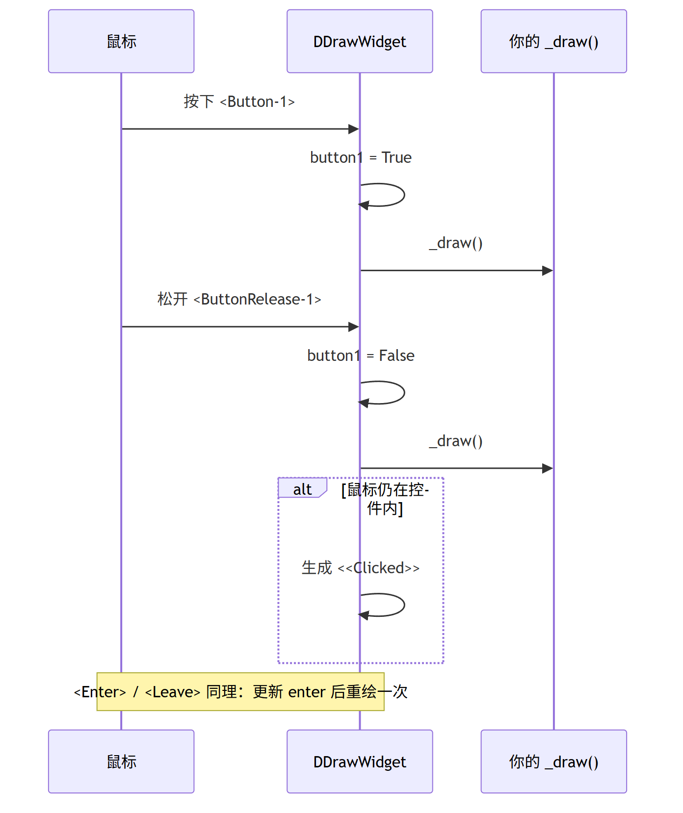
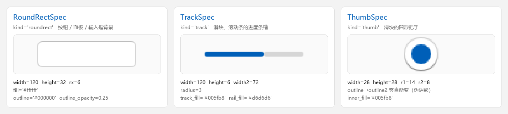

# 自定义组件

`tkdeft` 本身**不带任何具体组件**——它提供的是"把矢量图形变成 Tkinter 控件"
所需的那套零件。想做一个自己的组件，通常只要组合这四样东西：

| 零件 | 作用 |
| --- | --- |
| `DObject` | 统一的属性配置接口（`dconfigure` / `dcget`） |
| `DCanvas` | 带绘制能力的画布（`draw_roundrect` / `draw_track` / `draw_thumb`） |
| `DSvgDraw` | 把 SVG / 位图变成 `PhotoImage`（三种图元的 SVG 实现也在这里） |
| `DDrawWidget` | 事件 → 状态 → 重绘 的交互骨架 |

配套的完整示例可以参考 [tkfluent](https://pypi.org/project/tkfluent)——
它就是用这几个零件搭出来的组件库。

## DObject：配置容器

`DObject` 给组件一个**统一读写属性**的接口，避免到处写 `self.xxx = ...`：

```python
from easydict import EasyDict

from tkdeft.object import DObject


class MyWidget(DObject):
    # 类上写默认值；实例第一次读写时会拿到自己的副本
    attributes = EasyDict({
        "text": "",
        "text_color": "#000000",
        "state": "normal",
    })

    def set_text(self, text):
        self.dconfigure(text=text)


widget = MyWidget()
widget.set_text("你好")
print(widget.dcget("text"))       # 你好
print(widget.dcget("没这个键"))    # None
print(widget.dcget("没这个键", "-"))  # -（可以给默认值）
```

要点：

* `dconfigure(**kwargs)` **只接受已经存在于 `attributes` 里的键**，
  写错的键会被静默忽略——这是有意的：组件常把"一整份主题字典"直接丢进来，
  其中难免有当前版本用不到的字段。
* 所以要新增一个可配置项，必须先把键放进 `attributes`。
* `dconfigure()` 返回 `self`，可以链式调用：`obj.dconfigure(a=1).dconfigure(b=2)`。
* `dcget(key, default=None)` 读不到时返回默认值，不抛异常。
* 还提供 `dhas` / `dkeys` / `dvalues` / `ditems` / `dcopy` / `dreset`，
  以及 `in`、`len()`、迭代（都作用于属性字典）。

## DDrawWidget：交互骨架

`DDrawWidget` 是"用画布画出来的控件"的基类，它替你处理好了
**鼠标/焦点事件 → 内部状态 → 重绘** 这条链路：

```python
from tkdeft.windows.canvas import DCanvas
from tkdeft.windows.drawwidget import DDrawWidget


class MyCanvas(DCanvas):
    """不需要自定义绘制后端：DSvgDraw 已经带通用图元。"""


class MyWidget(MyCanvas, DDrawWidget):
    def _draw(self, event=None):
        super()._draw(event)              # 处理背景色等公共部分
        if not self.winfo_ismapped():
            return

        width, height = self.winfo_width(), self.winfo_height()
        if hasattr(self, "element"):
            self.delete(self.element)

        # interaction_state() 把三个状态位归并成 rest / hover / pressed / disabled
        color = {
            "rest": "#f3f3f3",
            "hover": "#ffffff",
            "pressed": "#cccccc",
        }[self.interaction_state()]

        # 一行画图元：栅格引擎走位图快速路径，否则自动回退 SVG；
        # 返回的一定是 canvas item id，不需要再判断 None。
        self.element = self.draw_roundrect(
            0, 0, width, height, 6,
            temppath=self.temppath,
            fill=color, outline="#000000", width=1,
        )
```

`DDrawWidget` 已经绑好并维护了这些状态，供 `_draw` 直接读取：

| 属性 | 含义 |
| --- | --- |
| `self.enter` | 鼠标是否在控件内 |
| `self.button1` | 左键是否按下 |
| `self.isfocus` | 是否持有焦点 |
| `self.temppath` ~ `temppath4` | 可复用的临时文件路径（惰性创建） |

触发重绘的事件：`<Configure>` `<Enter>` `<Leave>` `<Button-1>`
`<ButtonRelease-1>` `<FocusIn>` `<FocusOut>`。

松开左键且鼠标仍在控件内时，会生成一个 `<<Clicked>>` 虚拟事件：

```python
widget.bind("<<Clicked>>", lambda event: print("clicked"))
```

!!! warning "不要自己 mkstemp"
    `self.temppath` 这类属性是**惰性**的：真正用到时才创建文件，
    由绘图对象持有、并在控件销毁时回收。

    历史版本在 `__init__` 里一次性 `mkstemp()` 四个临时文件且从不关闭
    返回的 fd——20 个按钮就会泄漏 **80 个文件描述符 + 80 个残留文件**。
    请直接使用 `self.temppath`。

## 一次点击的完整顺序

<figure markdown>
  
  <figcaption>一次点击：每个事件都触发一次 <code>_draw()</code>；只有"按下且在控件内松开"才发 <code>&lt;&lt;Clicked&gt;&gt;</code></figcaption>
</figure>

所以"按住后把鼠标拖出去再松开"不会触发点击，与系统控件行为一致。

## 画图元：用统一入口，别自己分岔

`DCanvas` 提供三个"图元级"入口，它们内部已经处理好了
**栅格快速路径 → 失败回退 SVG** 的判定：

| 方法 | 图元 |
| --- | --- |
| `draw_roundrect(x1, y1, x2, y2, radius, radiusy=None, **kwargs)` | 圆角矩形 |
| `draw_track(x1, y1, width, height, width2, **kwargs)` | 进度条槽 |
| `draw_thumb(x1, y1, width, height, r1, r2, **kwargs)` | 圆形把手 |

<figure markdown>
  
  <figcaption>三个入口对应的三种绘制规格；图里的渲染来自真实引擎，放大 3 倍</figcaption>
</figure>

```python
item = self.draw_roundrect(
    0, 0, width, height, 6,
    fill="#ffffff", outline="#000000", outline_opacity=0.2,
)
```

想固定走某一条路，有两个开关：

```python
self.draw_roundrect(..., raster=False)   # 这一次强制 SVG
self.raster_enabled = False              # 这个画布都强制 SVG（做对照很有用）
```

想给某类图元**换一套实现**（比如固定圆角、加滤镜），覆盖对应的
`draw_*_svg` 方法即可，快速路径的判定仍然由基类负责：

```python
class BadgeCanvas(DCanvas):
    def draw_roundrect_svg(self, x1, y1, x2, y2, radius, radiusy=None,
                           *, temppath=None, temppath2=None, **kwargs):
        kwargs.setdefault("id", ".Badge")          # 给图元打个标记
        return super().draw_roundrect_svg(
            x1, y1, x2, y2, radius, radiusy,
            temppath=temppath, temppath2=temppath2, **kwargs,
        )
```

底层仍然可以按老办法直接用：

* `create_roundrect_raster` / `create_track_raster` / `create_thumb_raster`
  —— 只看栅格引擎，不支持时返回 `None`；
* `draw_svg_item(svg_path, temppath2, x, y)` —— 把 SVG 变成画布 item
  （会按当前引擎自动挑 tksvg / Wand）；
* `create_round_rectangle(...)` —— 历史方法名，等价于 `draw_roundrect`。

细节见 [绘制引擎](custom-drawing.md)。

## 别忘了保活图片

Tkinter 的画布元素**不会**替 Python 侧持有 `PhotoImage` 引用。
一旦图片被垃圾回收，对应的画布元素会变成**空白**：

```python
# ✗ 同一画布上多张图片时，只有最后一张能活下来
self._img = self.svgdraw.create_svg_image(path)
self.create_image(0, 0, anchor="nw", image=self._img)

# ✓ 交给画布保管
self._img = self.svgdraw.create_svg_image(path)
item = self.create_image(0, 0, anchor="nw", image=self._img)
self._keep_photo(item, self._img)
```

`DCanvas._keep_photo(item, photo)` 按画布元素 id 记录引用，
并在元素失效后自动清理。用 `draw_roundrect` 这类入口时，
保活已经替你做完了。

## 写自己的绘制后端

`DSvgDraw` 已经提供三种图元的通用 SVG 实现，多数情况下直接用它就够了。
如果你要画的是**别的东西**（自定义形状、外部素材），继承它并加方法：

```python
from tkdeft.windows.draw import DSvgDraw


class MyDraw(DSvgDraw):
    def create_star(self, size, temppath=None, fill="#ffcc00"):
        """画一个五角星，返回生成好的 SVG 文件路径。"""
        path, drawing = self.create_drawing(size, size, temppath=temppath)
        drawing.add(drawing.polygon(points=..., fill=fill))
        drawing.save()
        return path
```

要点：

* `create_drawing()` 返回 `(svg 路径, svgwrite.Drawing)`；
* 需要重用的临时文件用 `self.scratch_path(".svg", slot=1)` 申请，
  不要在每次绘制里 `mkstemp()`（会泄漏 fd 与残留文件）；
* 控件销毁时会调用 `cleanup()` 回收这些 scratch 文件。
